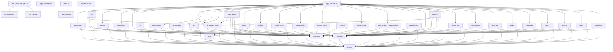

# Module Dependency Graph

Date: 2026-07-02

```mermaid
graph TD
  accounting --> common
  accounting --> prisma
  ai --> business_rules
  ai --> common
  ai --> platform
  ai --> prisma
  app.controller.spec.ts --> app.controller
  app.controller.spec.ts --> app.service
  app.controller.ts
  app.module.ts --> accounting
  app.module.ts --> ai
  app.module.ts --> assets
  app.module.ts --> attendance
  app.module.ts --> auth
  app.module.ts --> bi
  app.module.ts --> business_rules
  app.module.ts --> documents
  app.module.ts --> employees
  app.module.ts --> ess
  app.module.ts --> integrations
  app.module.ts --> leave
  app.module.ts --> mobile
  app.module.ts --> notifications
  app.module.ts --> observability
  app.module.ts --> organization
  app.module.ts --> payroll
  app.module.ts --> performance
  app.module.ts --> performance_optimization
  app.module.ts --> permissions
  app.module.ts --> platform
  app.module.ts --> plugins
  app.module.ts --> prisma
  app.module.ts --> public_api
  app.module.ts --> recruitment
  app.module.ts --> reporting
  app.module.ts --> roles
  app.module.ts --> scheduler
  app.module.ts --> search
  app.module.ts --> tenants
  app.module.ts --> users
  app.module.ts --> workflows
  app.service.ts
  assets --> common
  assets --> prisma
  attendance --> common
  attendance --> prisma
  auth --> prisma
  bi --> common
  bi --> platform
  bi --> prisma
  business_rules --> common
  business_rules --> platform
  business_rules --> prisma
  common
  documents --> common
  documents --> prisma
  employees --> common
  employees --> prisma
  ess --> common
  ess --> prisma
  integrations --> auth
  integrations --> business_rules
  integrations --> common
  integrations --> platform
  integrations --> prisma
  leave --> common
  leave --> prisma
  main.ts --> app.module
  mobile --> auth
  mobile --> common
  mobile --> platform
  mobile --> prisma
  notifications --> common
  notifications --> prisma
  observability --> common
  observability --> platform
  observability --> prisma
  organization --> common
  organization --> prisma
  payroll --> common
  payroll --> prisma
  performance --> common
  performance --> prisma
  performance_optimization --> common
  performance_optimization --> platform
  performance_optimization --> prisma
  permissions --> common
  permissions --> prisma
  platform --> prisma
  plugins --> business_rules
  plugins --> common
  plugins --> platform
  plugins --> prisma
  prisma
  public_api --> common
  public_api --> platform
  public_api --> prisma
  recruitment --> common
  recruitment --> prisma
  reporting --> common
  reporting --> prisma
  roles --> common
  roles --> prisma
  scheduler --> common
  scheduler --> platform
  scheduler --> prisma
  search --> common
  search --> platform
  search --> prisma
  tenants --> common
  tenants --> platform
  tenants --> prisma
  users --> common
  users --> prisma
  workflows --> common
  workflows --> prisma
```

## Detected Cycle Risks

| Cycle |
| --- |
| None detected |
